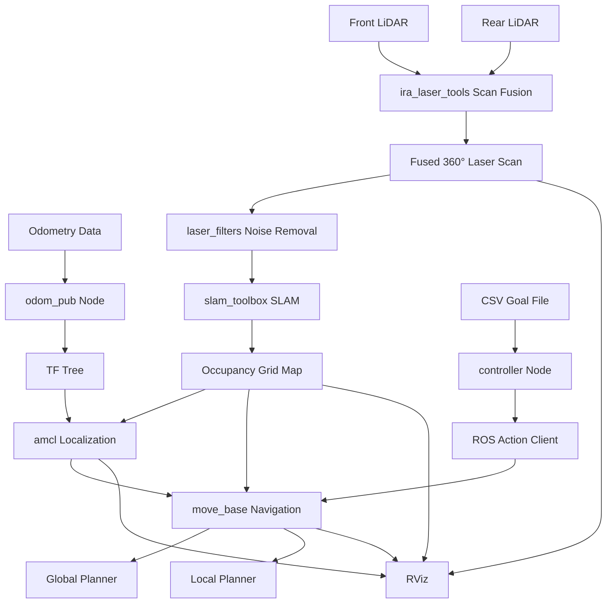
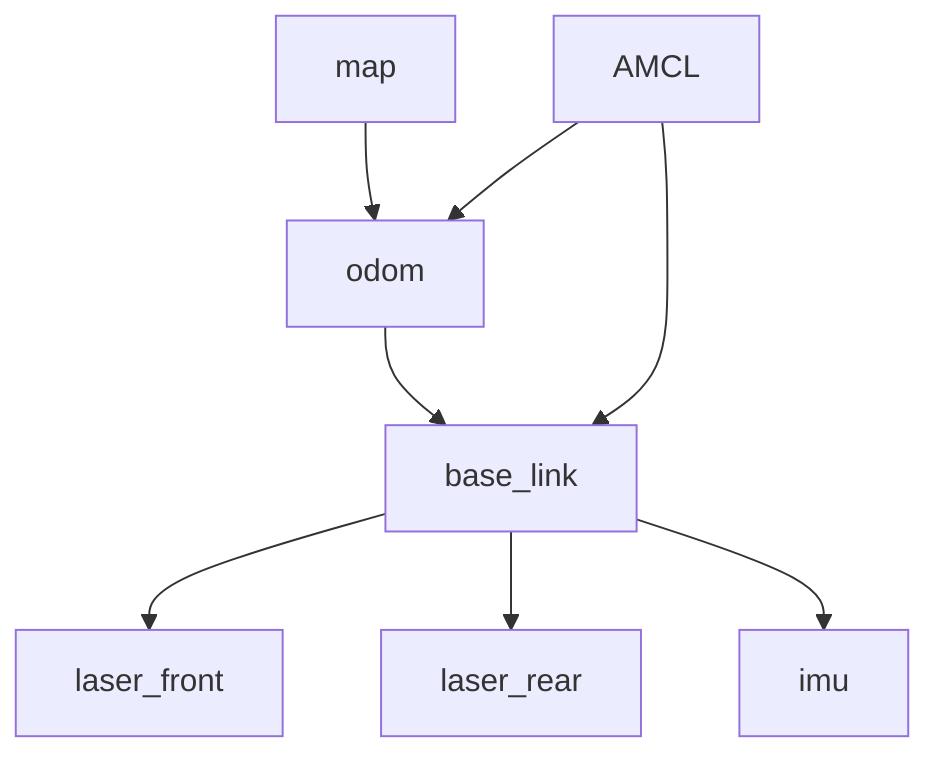
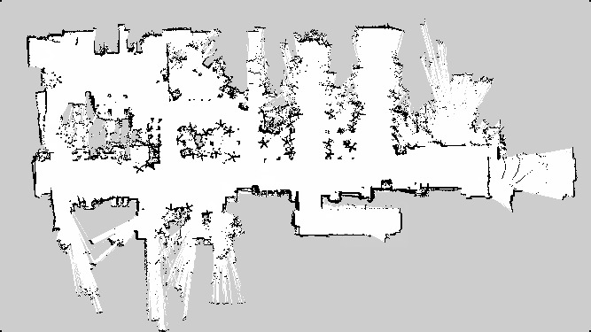

# ROS Mapping and Autonomous Navigation of a 4-wheeled robot


A complete robotics pipeline for 2D mapping and autonomous navigation using ROS, developed as part of a Robotics course project.
This project demonstrates how to process raw sensor data to build a map and enable a mobile robot to navigate autonomously in a simulated environment.

---

## Authors

- Andrea Venezia - [GitHub](https://github.com/veneziaandrea)
- Francesco Street - [GitHub](https://github.com/francescostreet)
- Francesco Urbano Sereno - [GitHub](https://github.com/FrancescoSereno)

--- 

## Project Overview

This project implements an end-to-end system for a 4-wheeled mobile robot, including:

- 2D mapping (SLAM) from noisy sensor data
- Probabilistic localization
- Autonomous navigation with obstacle avoidance
- Sequential goal execution using ROS Actions

The system is implemented in C++ using ROS1 and validated in simulation.

---

## System Architecture

## Full Pipeline



## TF Tree



---

## Mapping

The mapping pipeline processes noisy sensor data to generate a consistent 2D occupancy grid:

- Fusion of front and rear laser scanners into a single 360° scan
- Filtering of outliers and robot self-detection
- Conversion of odometry data into TF transforms
- Map generation using `slam_toolbox`



---

## Autonomous Navigation

The navigation system enables the robot to operate autonomously within the generated map:

- Localization using `amcl`
- Path planning and obstacle avoidance via `move_base`
- Execution of navigation goals loaded from a CSV file
- Goal management implemented through ROS Actions

---

## Key Challenges

### Noisy Odometry
Odometry data was highly noisy and unreliable for direct localization. This was mitigated using SLAM-based map estimation and AMCL probabilistic localization.

### Dual LiDAR Fusion
Two separate laser scanners were merged into a single 360° scan using `ira_laser_tools`, ensuring consistent environmental perception.

### Self-Detection Noise
Parts of the robot were incorrectly detected as obstacles and filtered out using `laser_filters`.

### Sequential Goal Execution
A custom ROS Action client was implemented to ensure robust sequential navigation with failure handling and state management.

---

## Quick Start

### Requirements

- Ubuntu 20.04
- ROS Noetic
- C++ toolchain

### Build

```bash
# 1. Clone repository
git clone https://github.com/veneziaandrea/4_wheeled_robot_slam_navigation.git
cd 4_wheeled_robot_slam_navigation

# 2. Move package into catkin workspace
cd ~/catkin_ws/src
ln -s /path/to/repo/src/second_project .

# 3. Build workspace
cd ~/catkin_ws
catkin_make
source devel/setup.bash
```

## Running the Simulation

# Mapping (SLAM)
```bash
roslaunch second_project mapping.launch
```

# Navigation (AMCL + move_base)
```bash
roslaunch second_project navigation.launch
```

Make sure to source ROS environment:
source /opt/ros/noetic/setup.bash
source ~/catkin_ws/devel/setup.bash

---

## Repository Structure
```bash
4_wheeled_robot_slam_navigation/
├── src/                                  
│   └── autonomous_robot_slam_navigation/                   
│       ├── src/                          
│       ├── launch/                       
│       ├── rviz/                         
│       ├── csv/                          
│       ├── config/                      
│       ├── stage/                                           
│       ├── CMakeLists.txt
│       └── package.xml
├── docs/                                
│   ├── images/                           
│   │   ├── map_clean.jpeg
│   │   └── navigation_demo.gif       
├── .gitignore                            
├── README.md                             
└── LICENSE
```
                             
**Note:** This repository does not include `build/` and `devel/` folders or `.bag` files, as per project requirements. No absolute paths are used in the code.

---

## Results

The system successfully:

- Generated a consistent 2D occupancy grid using SLAM
- Achieved reliable localization using AMCL
- Executed sequential navigation goals autonomously
- Avoided static obstacles during path planning

Performance was validated through:

- RViz visualization of map consistency
- TF tree correctness
- Successful completion rate of navigation goals

--- 

## What this project demonstrates

This project highlights:

- End-to-end ROS robotics pipeline design
- 2D SLAM using noisy real-world-like data
- Sensor fusion (dual LiDAR merging)
- Probabilistic localization (AMCL)
- Autonomous navigation (global + local planning)
- ROS Action-based task sequencing
- TF tree management and odometry handling

--- 

## Future Work

- Migration to ROS2 (Humble / Iron)
- Deployment on real hardware platform
- Integration of dynamic obstacle avoidance (e.g., DWA tuning / ORCA)
- Improved global planner (e.g., SBPL or hybrid A*)
- Map optimization using loop closure refinement

--- 

```markdown
##  Requirements

* **Operating System:** Ubuntu (20.04 LTS or newer recommended)
* **ROS (Robot Operating System):** Noetic (or the specific version you used if different). [cite_start]The project specifies C++ development.

ROS Dependencies: 

 Core dependencies
- roscpp
- rospy
- std_msgs
- geometry_msgs
- tf
- nav_msgs
- message_filters
- message_generation
- message_runtime
- actionlib

### Navigation & Mapping
- slam_toolbox
- amcl
- move_base

### Sensor processing
- ira_laser_tools
- laser_filters

### Simulation
- stage_ros
```


This project is released under the MIT License. See the `LICENSE` file for more details.
